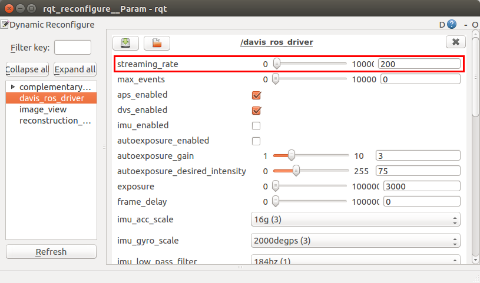

# Complementary Filter

This package allows image reconstruction by combining events with APS intensity image frames.

## Run Instructions

Remember to source your variables from the bash file created when the packages were built.
    
    source ~/catkin_ws/devel/setup.bash

### Live with DAVIS camera:
 
The package will process event messages and image messages as they arrive, without buffering. If you notice lag between the frames and the events, please try increasing the [streaming rate](#streaming-rate) of the camera.

Launch the complementary_filter package with the below command

    roslaunch complementary_filter davis_mono.launch
    
### From pre-recorded rosbag:
Download a rosbag from the [DVS Image Reconstruction Dataset](https://drive.google.com/drive/folders/1Jv73p1-Hi56HXyal4SHQbzs2zywISOvc?usp=sharing) or the [RPG Event-Camera Dataset](http://rpg.ifi.uzh.ch/davis_data.html).

#### NEW: Offline Mode (recommended)

Open a terminal and launch roscore:

    roscore
    
In another terminal launch the package:
    
    roslaunch complementary_filter from_rosbag.launch bag_path:=<path/to/input/rosbag.bag> save_dir:=<directory/to/save/images/> publish_framerate:=<framerate>
    
where bag_path:=, save_dir:=, and publish_framerate:= are optional command-line arguments.
If publish_framerate < 0, it will publish an image for every event packet message.
To pre-set [dynamic reconfigure parameters](#reconfigure), first launch the package without specifying bag_path:= and modify (or load) parameters, then (without closing roscore) close and re-launch the package with bag_path:=.
You can [save and load](#reconfigure) reconfigure parameters to and from .yaml files using [rqt_reconfigure](http://wiki.ros.org/rqt_reconfigure).

E.g.

    roslaunch complementary_filter from_rosbag.launch bag_path:=my_rosbag.bag

#### Old way
Note: event messages are timestamped by the timestamp of the last event. Thus, events and frames may be processed slightly out of order. To ensure correct ordering please use [offline mode](#new-offline-mode-recommended).

Open a terminal launch roscore:

    roscore
    
In another terminal:

    rosbag play -l <path-to-rosbag>
    
In another terminal launch the complementary filter:
    
    roslaunch complementary_filter from_rosbag.launch
    
    
## Using reconstructed frames from another method as low-frequency input to the complementary filter

First store the reconstructed images in a rosbag with the events.

In [launch/from_rosbag.launch](launch/from_rosbag.launch) modify (line 17):

        <remap from="image_raw" to="dvs/image_raw" />
        
to

        <remap from="image_raw" to="your_reconstruction_topic" />

## Reconfigure

**Auto_detect_contrast_thresholds** (may slow performance): Overrides user-set contrast thresholds and instead tries to infer contrast thresholds based on differences between APS image frames. Experience shows this is not typically so reliable, you may get better results disabling this and manually tuning Contrast_threshold_OFF/ON.

**High_dynamic_range_mode** (may slow performance): Adjusts per-pixel Cutoff_frequency based on brightness of APS frame. Pixels with a value close to the minimum or maximum are assigned a lower Cutoff_frequency.

**Cutoff_frequency:** Gain that determines relative weight of events vs. frames. Cutoff_frequency = 0 is a pure event integrator that does not use frames. Cutoff_frequency = inf. would be a zero-order-hold on frames that does not use events.

**Contrast_threshold_OFF/ON:** Change in log intensity encoded by one event (caution! Overriden by Auto_detect_contrast_thresholds).

**Intensity_min/max** (reasonable range: \[0, 1\]): Displayed image will be normalised between these bounds, and truncated outside. Applies after image has been converted from log scale to natural scale, i.e. after image = exp(image) - 1.

**Spatial_filter_sigma:** Strength of post-processing smoothing step (only applies to displayed image). To disable, set to zero.

**Bilateral_filter:** Uses bilateral filter instead of Gaussian (default).

### Streaming Rate

