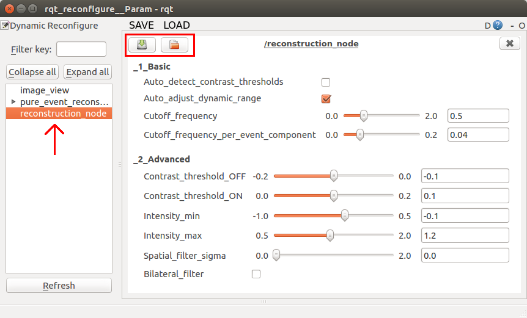

# Pure Event Reconstruction

This package allows image reconstruction from only events.

## Run Instructions

Remember to source your variables from the bash file created when the packages were built.
    
    source ~/catkin_ws/devel/setup.bash

### Live with DAVIS camera:

 
to launch DAVIS with APS frames enabled (not used for reconstruction).

    roslaunch pure_event_reconstruction davis_mono.launch
    
### From pre-recorded rosbag:
Download a rosbag from the [DVS Image Reconstruction Dataset](https://drive.google.com/drive/folders/1Jv73p1-Hi56HXyal4SHQbzs2zywISOvc?usp=sharing) or the [RPG Event-Camera Dataset](http://rpg.ifi.uzh.ch/davis_data.html).

Open a terminal launch roscore:

    roscore
    
In another terminal:

    rosbag play -l <path-to-rosbag>
    
In another terminal launch the complementary filter:
    
    roslaunch pure_event_reconstruction from_rosbag.launch
         
## Reconfigure

**Auto_detect_contrast_thresholds** (may slow performance): Maintains a leaky event count for ON and OFF events, i.e. the count goes down over time. The contrast thresholds are adjusted to match: 
&emsp; *contrast_ON \* number_of_events_ON = contrast_OFF \* number_of_events_OFF*.

**Auto_adjust_dynamic_range** (recommended): Overrides and auto-adjusts lower and upper intensity limits for display \[Intensity_min, Intensity_max\].

**Cutoff_frequency:** Gain that determines how quickly the image will fade over time.

**Cutoff_frequency_per_event_component:** Additional gain parameter that will cause a pixel to fade only when it receives an event. Intended use for when Cutoff_frequency is small or zero (try setting Cutoff_frequency=0).

**Contrast_threshold_OFF/ON:** Change in log intensity encoded by one event.

**Intensity_min/max** (reasonable range: \[0, 1\]): Displayed image will be normalised between these bounds, and truncated outside. Applies after image has been converted from log scale to natural scale, i.e. after image = exp(image) - 1.

**Spatial_filter_sigma:** Strength of post-processing smoothing step (only applies to displayed image). To disable, set to zero.

**Bilateral_filter:** Uses bilateral filter instead of Gaussian (default).
